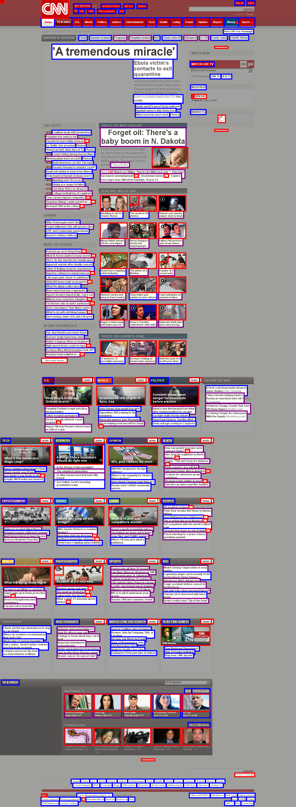
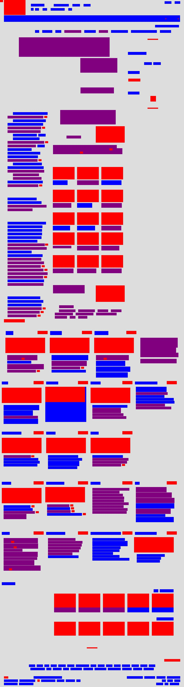
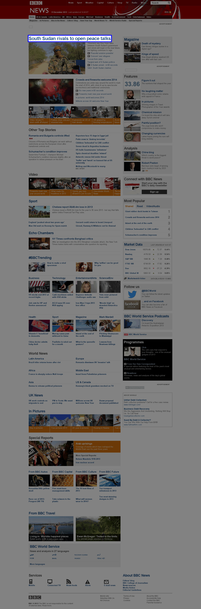

Visualizing archived URLs
=========================

Highlighted overlay
-------------------

You can output a static image that pops out headlines, stories and images on
the page using the ``ArchivedURL.write_overlay_to_directory`` method available on
all :py:func:`ArchivedURL` objects.

.. code-block:: python

    obj = storytracker.archive("http://www.cnn.com")
    obj.write_overlay_to_directory("/home/ben/Desktop")

The resulting image is sized at the same width and height of the real page.
Images have a red stroke around them. Hyperlinks the system thinks link 
to stories have a purple border. The rest of the links go blue.

Abstract illustration
---------------------

You can output an abstract image visualizing where headlines, stories and images are on
the page using the ``ArchivedURL.write_illustration_to_directory`` method available on
all :py:func:`ArchivedURL` objects. The following code will write a new image of the CNN homepage to my desktop.

.. code-block:: python

    obj = storytracker.archive("http://www.cnn.com")
    obj.write_illustration_to_directory("/home/ben/Desktop")

The resulting image is sized at the same width and height of the real page,
with images colored red. Hyperlinks are colored in too. If our system
thinks the link leads to a news story, it's filled in purple. Otherwise it's colored blue.

 

Animation that tracks hyperlink's movement
------------------------------------------

You can create an animated GIF that shows how a particular hyperlink's position
shifted across a series of pages with the following code. 

.. code-block:: python

    >>> urlset.write_href_overlay_animation_to_directory(
    >>>    # First give it your hyperlink
    >>>    "http://www.washingtonpost.com/investigations/us-intelligence-mining-data-from-nine-us-internet-companies-in-broad-secret-program/2013/06/06/3a0c0da8-cebf-11e2-8845-d970ccb04497_story.html",
    >>>    # Then give it the directory where you'd like the file to be saved
    >>>    "./"
    >>> )

